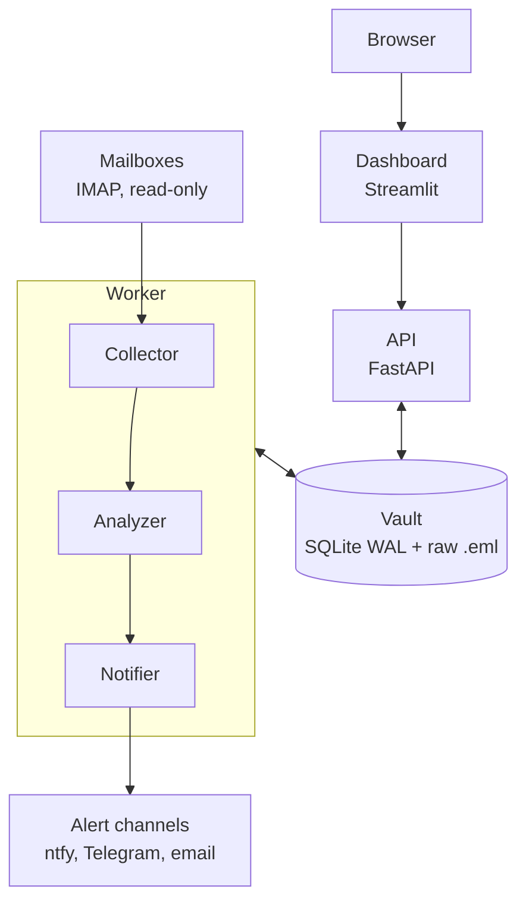

# Heron architecture

Heron is a self-hosted, single-user phishing detector. It watches your
mailboxes over IMAP (read-only), analyzes each message, and shows verdicts,
reasons, and recommended actions in a dashboard. Everything runs on your
machine.

> This is a design document. See [Implementation status](#implementation-status)
> for what exists today.

## Goals

- **Private by default.** Mail never leaves the machine unless the user opts in
  to an online lookup.
- **Read-only.** Heron never modifies, moves, or marks mail in a mailbox.
- **Simple to run.** `docker compose up`: three containers, one data volume.
- **Explainable.** Every verdict lists the rules that produced it.
- **Resilient.** The UI never talks to IMAP, and long jobs can resume after a crash.

## Overview



| Component | Responsibility |
|---|---|
| Dashboard | Streamlit UI. Stateless. Only talks to the API. |
| API | FastAPI. Authentication, mailbox management, enqueues jobs, serves queries. |
| Worker | Collector (IMAP fetch, live and by date range), Analyzer (parse, rules, score), Notifier (push alerts). |
| Vault | SQLite in WAL mode for structured data, plus raw `.eml` files on disk. |

## How the pieces talk

The API and the worker never call each other. They communicate through the
vault: the API writes a row to the `jobs` table, and the worker claims it,
does the work, and writes results back. No message broker is needed, and a
crashed worker loses nothing.

## Data flow

1. **Add a mailbox.** The credentials are encrypted before they are stored.
2. **Initial sync.** "Today" is computed in the configured timezone and converted
   to UTC half-open bounds. A job fetches those messages.
3. **Analyze.** Each message is stored raw, parsed, run through the rules, and
   scored. Alerts are created above a severity threshold.
4. **View a date range.** The API checks the `coverage` table for days already
   ingested and queues jobs only for the gaps. The dashboard shows progress
   and refreshes as results arrive.
5. **Live mode.** The collector keeps "today" current using IMAP IDLE or polling.

## Key design decisions

1. **SQLite in WAL mode.** One file, no extra service, and readers do not block
   the writer. Postgres can be added later if it is ever needed.
2. **The database is the job queue.** Fewer moving parts for people installing it.
3. **Coverage tracking.** A `coverage` table records which date ranges of each
   mailbox are already ingested, so range selection never re-scans mail.
4. **Deduplication key** is `(account_id, folder, uidvalidity, uid)`. `Message-ID`
   is sender-controlled and can be missing or reused, so it is stored but never
   trusted for uniqueness.
5. **Timestamps use the IMAP `INTERNALDATE`** (when the mail server received the
   message), stored as UTC. The `Date` header is sender-controlled and is kept
   as a separate field. Range filters use `ts >= start AND ts < end`.
6. **Raw mail is stored once** as an immutable file (`data/eml/<sha256>.eml`).
   Parsed data and analyses are separate, and analyses carry a `rules_version`
   so old mail can be re-scored after rule changes.
7. **Read-only mailbox access.** Folders are opened with `EXAMINE` and messages
   fetched with `BODY.PEEK`, so nothing is marked as read.
8. **Credentials** are encrypted with Fernet (AES-128-CBC with HMAC-SHA256).
   The key is read from the environment or generated on first run into the data
   volume. Losing the key means re-entering mailbox passwords.
9. **Email is hostile input.** HTML is never rendered raw, URLs and IPs are
   defanged for display, links are never fetched automatically, and attachments
   are only hashed and inspected, never opened or executed.
10. **Rules are explainable and versioned.** A verdict is a list of triggered
    rules with weights, not just a number.

## Data model (planned)

`accounts`, `jobs`, `coverage`, `emails`, `analyses`, `iocs`, `alerts`, `settings`.
The schema is introduced in migrations starting on Day 5 of the roadmap.

## Repository layout

```
src/heron/
  core/        settings, database engine, migrations runner
  migrations/  Alembic environment and versions
  ingest/      IMAP client, collector, jobs, coverage      (planned)
  analysis/    parser, IOC extraction, rules, scoring      (planned)
  api/         FastAPI routers                             (planned)
  worker/      worker main loop                            (planned)
  ui/          Streamlit app                               (planned)
tests/         unit tests and synthetic email fixtures
docs/          design documents
```

## Implementation status

- [x] Repository, tooling, pre-commit, CI
- [x] Settings loader, SQLite engine with WAL, Alembic baseline
- [ ] Time handling, encryption, storage with deduplication
- [ ] IMAP ingestion, jobs, coverage tracking
- [ ] API
- [ ] Analysis rules and scoring
- [ ] Dashboard
- [ ] Docker packaging and first release
